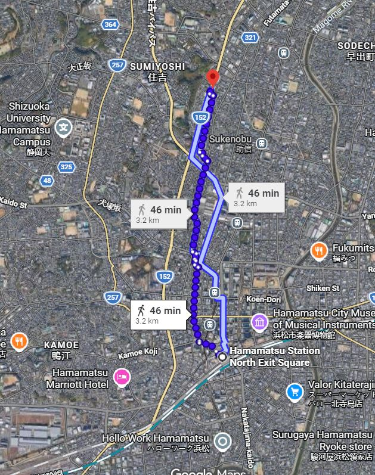
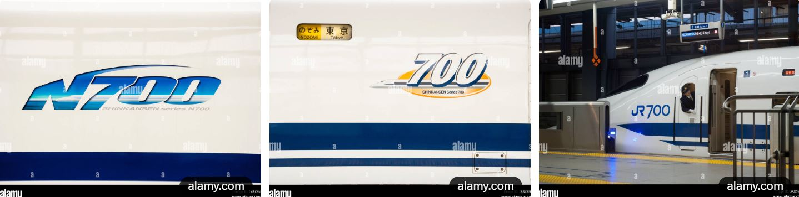
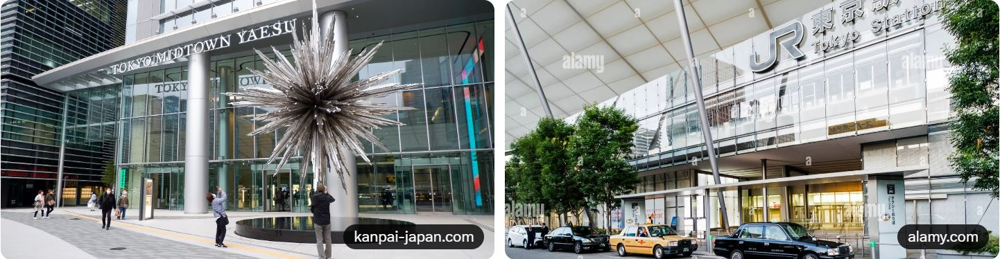
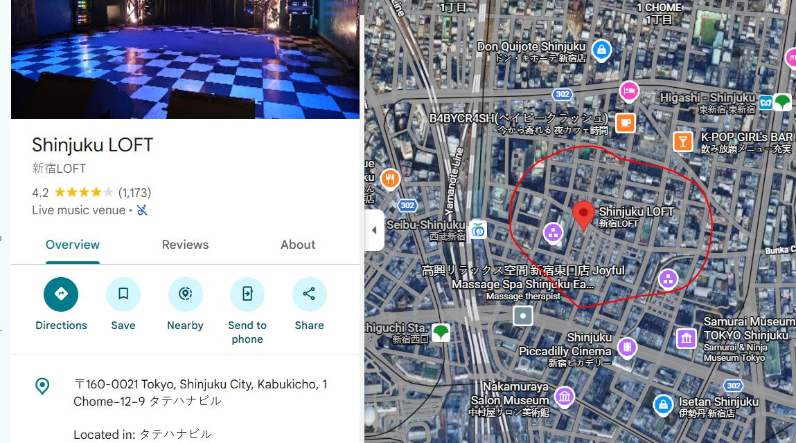
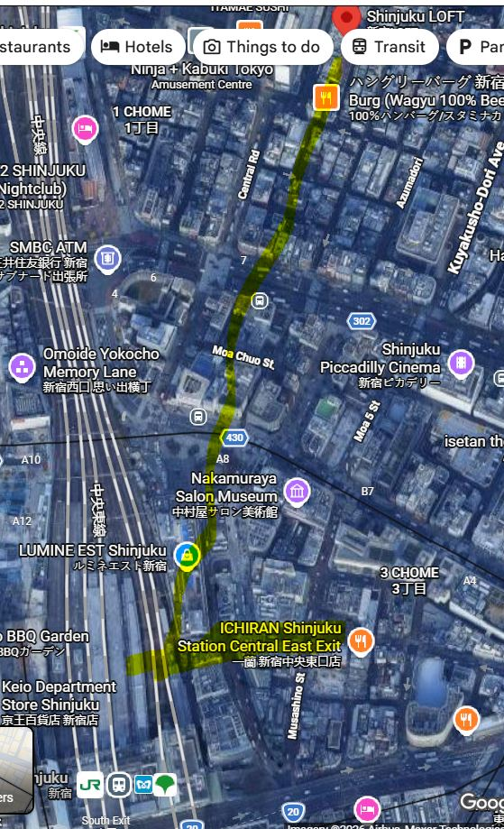

::: {.roboto}

::: {.panel-tabset}

### Card

**Perfect! You're in the right spot — Roppongi has excellent options right nearby.**

#### Top Recommendation: **Shodocafe7557** (in Roppongi)
- **Location**: Just 3 minutes walk from Roppongi Station (Crest Roppongi 2F, 7-9-3 Roppongi, Minato-ku).
- They specialize in **Japanese calligraphy experiences** and custom pieces.
- You can do a 60-minute session: learn brush some kanji, enjoy matcha, and create a personalized item (they do cards, shikishi boards, fans, scrolls, etc.).
- Great for a wedding message like **「ご結婚おめでとうございます」** (Congratulations on your marriage!).
- They’ve done wedding gifts before and can customize for you.

You can book directly on their site (shodocafe7557.com) or just walk in if they have availability — very tourist-friendly.

#### Other quick options in/near Roppongi:
- **Stationery stores**: 
  - **Loft Roppongi** or **Itoya** (nearby in Ginza/Roppongi Hills area) — buy a beautiful blank *washi* card first, then ask staff for calligraphy recommendations or take it to a studio.
- Other nearby **shodo studios** or workshops — search “書道 体験 六本木” on Google Maps for pop-ups.

If you want something ready-made fast, many of these places can do a quick custom brush job on a card you bring or buy there. It’ll be a unique, heartfelt gift from Japan.

Drop by Shodocafe7557 if you can — it sounds ideal for your cousin’s wedding! Let me know if you need directions, phrases to say, or more spots. 🎋

### Jazz &#9835;

**Yes, there are several small/intimate jazz shows and sessions happening in Tokyo tonight (Tuesday, July 14, 2026).** Tokyo has a vibrant jazz scene with many cozy venues—perfect for catching local talent in relaxed settings.

Here are some solid small-venue options starting in the evening (times are JST; check official sites or call ahead as details can shift):

#### **New Shinjuku Pit Inn** (Shinjuku — classic intimate spot)
- **19:00–**: Keiko Lee Band (vocalist-led with strong rhythm section). Charge around ¥6,600 (incl. drink). A bit bigger name but still a great small-club vibe.

#### **INDEPENDENCE** (Ikebukuro)
- **19:30**: 大山日出男 Quartet (alto sax leader). Music charge ~¥3,000. Cozy, straightforward jazz club atmosphere.

#### **Velera** (Akasaka-mitsuke)
- **19:30~**: 窪田想士カルテット (vibraphone-led quartet). ¥4,500. Intimate setting with good food/drinks.

#### **そるとぴーなつ (Salt Peanuts)** (Echika / Koenji area)
- **19:00–21:50** (2 sets): 米田あゆ TRIO (alto sax). Live charge ¥2,000 + table ¥1,000 (nuts all-you-can-eat) + drinks. Super small and casual—very neighborhood jazz feel.

#### **dot&blue** (Akasaka)
- **19:00~22:00**: Open Mic / Session hosted by 緑川愛 (piano). ¥2,200 music charge + 2 orders. Relaxed, participatory vibe—great if you want something loose.

#### Other quick mentions for small spots:
- **The Deep** (Ginza) → Vocal performance (河原厚子 etc.) — very cozy bar.
- **STACCATO** (Asagaya) → Vocal + band set, around ¥4,000.

**Tips**: Many places have a music charge + drink/food minimum (common in Japan jazz clubs). Reservations are smart for popular ones, especially on weekdays. Use Google Translate on venue sites if needed. Sites like [kyoujazz.com](https://kyoujazz.com/) are gold for real-time listings.

Enjoy the music—Tokyo jazz hits different in a tiny basement club! If you want directions or more details on a specific one, let me know. 🎷

### Hammamatsu

Sonix is 45 minute walk (North) from Station -- parallel 152:

Many routes of Shinkansen (bullet train). Use Shinkansen here—they do not use “bullet train”.

The specific route is Tokaido. West bound train starts at Tokyo Station, and stops at Shinagawa. You can board on either in Tokyo the city.

Don’t know Shinagawa. Boarded in Tokyo Station. The station is huge. The closest entrance is “Yaesu” area. Don’t know what the name means but it’s on Google map. It is basically on the east side of the station.

Near the entrance, there is a JR ticket office. Japan Railway I guess? You can get tickets there. But I used a machine that specifically sells Shinkansen tickets.

I bought “Reserved Ticket”. It paid for the base price and a seat reservation price. If you get non-reserved ticket, some cars are designated “free seating” car. Usually there are signs about which. “Green Car” is 1st class seats. Never bought them. Seems like window E seats westbound you have a chance to see Mt Fuji.

You can search train using departure or arrival time. You will be asked the FROM city, the TO city, and whether one way or return.

Train from Tokyo Station to Hamamatsu has either the name Hikari or Kodama, followed by a number. Hikari has fewer stops, takes 1 hour 24 min. Kodama is slower: 1 hour 49 min. I took 2:03 Hikari 715. Hikari runs every hour at the 3rd minute. Number maybe different at different times. So I look for “14:03 Hikari 715”. You would see this info on the side of the train and inside the train too. So you cannot miss.

The machine gave me three papers but only one is the ticket. It is a shorter one with the most info printed on it.

This is the most confusing part. When I passed through the first gate with the ticket, I cannot find my train or the platform. I saw an arrow with the Shinkansen logo with the name “Tokaido”. I followed the direction, passed a second gate (using the same ticket) and then found the platform. You ticket should also tell you the car number and seat number.

Good luck tomorrow!

### Ska Crash

[SkaCrash26](https://www.loft-prj.co.jp/schedule/loft/schedule/353698)

Shinjuku Loft
1-12-9 Kabukicho, Shinjuku-ku, Tokyo 160-0021, Japan (Tatehana Building B2)
新宿ロフト
〒160-0021 東京都新宿区歌舞伎町1-12-9 タテハナビルB2

- **Walk** ~5-6 min to **Roppongi Station** (Toei Oedo Line / Tokyo Metro Hibiya Line, Exit 5 or nearby).
- Take the **Toei Oedo Line** toward **Shinjuku** or **Hikarigaoka** (counter-clockwise direction) — direct ride, about **9-12 minutes**.
- Get off at **Shinjuku Station** (or Shinjuku-Nishiguchi for slightly closer access).
- **Walk** ~5-10 min to Kabukicho (east side of Shinjuku Station, toward Yasukuni-dori). The Tatehana Building is a short walk into the district.

**Fare**: ~¥170-220. Very reliable with frequent trains (every ~10 min).

**Yes — you generally pay (or finalize payment) when you exit at your destination station.**

How Tokyo Subway Fares Work
Tokyo uses a **distance-based fare system**. You don’t pay a fixed “toll” upfront for most journeys.

- **With an IC card** (recommended — Suica, PASMO, or any compatible card, including many contactless credit/debit cards and Apple/Google Pay):
  - **Tap in** at the entry gate (blue sensor area).
  - **Tap out** at the exit gate when you leave.
  - The system automatically calculates the exact fare based on distance traveled and deducts it from your balance.
  - Super convenient — no need to know the fare in advance.

Step-by-Step Navigation for First-Timers
1. **Find the right station entrance**  
   Look for signs with the station name + subway symbols (Tokyo Metro is a white “M” on blue; Toei Subway has its own logos).

2. **Buy / prepare your ticket or card**  
   - Best option: Get a **Suica or PASMO** IC card from a vending machine (or use contactless credit card if supported).  
   - Add some money (¥1,000–2,000 is plenty for a few trips).

3. **Enter the gate**  
   - Tap your IC card or insert ticket.  
   - Follow signs to your **line** (e.g., “Oedo Line” or “Hibiya Line”) and **direction** (e.g., toward Shinjuku).

4. **On the platform**  
   - Check the electronic boards for the next train and which car stops closest to your exit.  
   - Stand behind the yellow lines.

5. **Ride the train**  
   - Trains are clean, quiet, and very punctual.  
   - Announcements are in Japanese + English.  
   - Priority seats are for elderly, disabled, pregnant people, etc.

6. **Exit at your destination**  
   - Follow signs for the exit closest to your destination (e.g., “East Exit” for Kabukicho).  
   - **Tap out** (or insert ticket).  
   - If using IC card → fare is deducted automatically.  
   - If short on fare → use the adjustment machine (it has English).

Quick Tips for Your Roppongi → Kabukicho Trip
- For the **Toei Oedo Line** direct route: Tap in at Roppongi, tap out at Shinjuku / Shinjuku-Nishiguchi. Very straightforward.
- Trains run frequently (every 3–10 minutes during the day).
- Be mindful of your belongings (pickpocketing is rare but possible in crowded areas).

**IC card is by far the easiest way** — just tap in, tap out, and go. You’ll get the hang of it after one or two rides! Let me know if you need help with a specific station map or line. Safe travels! 🚇

### Ming's Plans

Some of my suggestions and my travel plan.

Ska concert: <https://www.loft-prj.co.jp/schedule/loft/schedule/353698> You should consider going. On the 12th. I will pass.

Bullet train (shinkansen): Probably we can get tickets easily at the station for our time period. I usually get (1) a base ticket and (2) a seat reservation. If you take a base ticket but no seat reservation, you can sit on a seat that is not reserved. There is usually an indicator at the seat. If the seat is later reserved after you have sat down, when the person shows up, just give up the seat for the person. There are two class of tickets I usually get the cheaper one.

Tokyo to Hamamatsu: Two stations (Tokyo or Shinagawa). Google said 1 hour 7 minutes to Hamamatsu.

Places to visit from Tokyo for a day trip: Nikko, Yokohama, Kamakura, Hakone, Mount Takao.

Neighborhood to visit: Too many to list, but Koenji and Shimokitazawa are more hipster places to visit. Famous tourist neighborhoods are Asakusa, Ginza, Roppongi, Ueno, Akihabara, Shinjuku, Shibuya, Ikekuburo, Harakuju. If you want to try a food vendor with a few seats, Golden Gai in Shinjuku is famous (and touristy).

Animal cafe: Some cat cafe are well-run and treat their cats nice, some do not. Capybara cafe has been popular lately. Some require advanced booking.

Cheap food to try: Maria and I like the food in all convenience stores (7/11, Lawson and Family Mart) and Mos Burger. I am partial to Denny's and Jonathan's.

Baseball game: There seems to be a professional baseball game in Tokyo on July 15 between Tokyo Yakult Swallows and Yomiuri Giants in Shinjuku, 6:00pm.

July 11:
  
  + We arrive at 1:50pm. Expect 1-2 hours to get out of immigration and customs. Let's grab a taxi to Roppongi. Google said around $60.00. I am happy to pay.  
  + Hopefully at hotel before 5:00pm.  
  + We have a booking of the cocktail bar at 8:00pm. They serve food I think. Will check.

July 12:  

+ Probably do some shopping.  
+ <https://tokyocheapo.com/place/sou-sou-kyoto-aoyama/>  
+ <https://tabiousa.com> (The brand is available in many places in Tokyo)
+ SUGGESTION TO YOU: <https://www.loft-prj.co.jp/schedule/loft/schedule/353698>
+ I will head to Hamamatsu after shopping. If you go to the concert, I suggest you come to Hamamatsu early in the morning of the 13th. If you don't go to the concert, you can come with me. If we go together, we should have a good izakaya dinner at Hamamatsu.
+ I stay at Okura ACT City Hamamatsu hotel, which is next to the station.

July 13:  

  - Visit a few places.  
  - If you come to Hamamatsu on the 13th and stay overnight, then we can have dinner together.

July 14:  

+ Spend time in Hamamatsu in the morning and then go to Hakone.  
+ I will spend time with my sensei in Hakone--lesson and dinner. Then I will stay overnight in an onsen hotel.  

July 15:  

+ Leave Hakone and go to Shinjuku, Tokyo.  
+ No plan so far.  

July 16:  

+ Maybe more shopping in the morning.  
+ Leave for Narita airport shortly after lunch.  

### Tokai &#119074;

**Tokai basses are a great find in Japan** — the brand is headquartered and hand-builds instruments in Hamamatsu, so you're starting in the right city. New and especially used/vintage Tokai basses (including Jazz Bass-style models like the APB series) do appear regularly in Japanese shops, particularly places specializing in used or Japanese-made gear.

Here are the **best bets**, prioritized by your plans:

## 1. Hamamatsu (Start Here)
Your best local option is **SONIX (ソニックス)**, widely regarded as the biggest and strongest music store in Hamamatsu for **used instruments**, guitars, basses, and repairs. They buy/sell a lot of used gear and are your highest-likelihood spot in the city itself for a used Tokai bass.

- **Address**: 4-5-8 Takabayashi, Chuo-ku, Hamamatsu-shi, Shizuoka 430-0907
- **Phone**: 053-476-6688
- **Hours**: 11:00–20:00 (closed Tuesdays)
- They list inventory on **Digimart** (see below), so you can check stock ahead of time.

There isn't a public Tokai factory outlet or retail showroom for walk-in purchases (the factory is in the outskirts and past visits were by special arrangement only).

**Bonus nearby**: The **Hamamatsu Museum of Musical Instruments** is worth a quick visit for context (it's the "City of Music" after all), but it's a museum, not a shop.

## 2. Tokyo – Ochanomizu Guitar Street (Highest Overall Likelihood)
This is **the premier destination** in Japan for new and especially **used/vintage Japanese guitars and basses** (Tokai, Greco, Yamaha, etc.). The density of shops is unmatched — it's basically guitar heaven on one street (Meidai-dōri). Many stores have dedicated used sections and regularly stock Tokai instruments.

**Top recommendations**:
- **Ishibashi Music (イシバシ楽器)** — Multiple locations, including the big Ochanomizu Honten and "Finest Guitars" section nearby. Excellent selection of both new Tokai models and used/vintage ones. They handle tourists well (English support, tax-free with passport).
- **Shimokura Musical Instruments / Shimokura Second Hands** — Two locations right on Guitar Street. One of the best for **used and vintage** Japanese instruments. Often has deeper stock of older Tokai pieces.

Other solid shops on the same street include Guitar Planet, Kurosawa, and various smaller used-focused spots. Just walk the street — you'll see guitars everywhere.

**Travel tip from Hamamatsu**: Take the Shinkansen (Hikari or Kodama) to Tokyo Station (~1h 15–40 min), then a short subway/walk to Ochanomizu. Very doable as a day trip or overnight. Worth it if you're serious about finding a Tokai bass.

## Other Strong Options If You're Willing to Travel
- **Nagoya** — Ishibashi has a store here, and there are used instrument shops (e.g., around the Gakuya area). It's closer to Hamamatsu (~45–60 min by train) than Tokyo.
- **Other big cities** — Ishibashi branches in Osaka, Yokohama, etc., are reliable for new stock.

## Pro Tips for Hunting Tokai Basses
- **Digimart.net** (or the app) is your best friend — Japan's biggest aggregator of used instruments. Search "**tokai ベース**" (Tokai bass) or filter by brand "Tokai" + bass category. It shows real-time stock from stores across Japan (including SONIX, Ishibashi, Shimokura, etc.) with photos, condition, and prices. Many listings are from the exact shops you'll visit.
- **New vs Used**: SONIX leans heavily used. Ochanomizu has the best mix — current production Tokai basses (e.g., APB-101 models) plus plenty of older Japanese-made ones.
- **Tax-free shopping**: Bring your passport — most major stores offer duty-free for tourists.
- **Bargaining**: Common on used items (especially cash or multiple purchases). Don't be shy but stay polite.
- **Condition check**: Japanese used gear is usually well-maintained, but always play/test thoroughly.

**Quick plan suggestion**:
1. Hit **SONIX** in Hamamatsu first (easy local win for used).
2. If nothing clicks or you want more options, head to **Ochanomizu** in Tokyo — that's where you're most likely to score a great Tokai bass (new or used/vintage).

Would you like me to help narrow it down further (e.g., specific models you're after, budget range, or current Digimart-style stock ideas)? Or need addresses/maps for any of these spots? Safe travels and happy hunting! 🎸

:::

:::